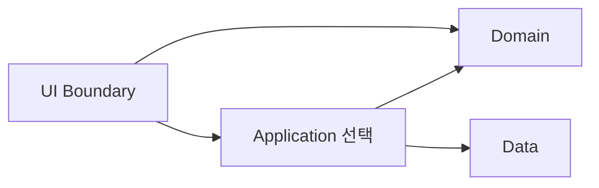

# Magic Square (4×4) — 레이어·계약·TDD 설계 보고서

## 개요

- **문서 목적:** Magic Square(4×4) TDD 연습 과제에 대해 **Logic(Domain) / UI(Boundary) / Data**의 책임 분리, **도메인 불변조건**, **입·출력 계약**, **RED 우선 테스트 설계**, **통합·추적성(Traceability)**을 보고서 형식으로 정리한다. **구현 코드는 본문에 포함하지 않는다.**
- **대상 독자:** TDD 학습자, 리뷰어, 멘토, 아키텍처 검토 담당자.
- **작성일:** 2026-04-28
- **버전:** 1.1
- **선행·정합:** `01` 문제 정의, `02` Dual-Track·클린 아키텍처, `04` User Journey/추적성, `05` PRD·입·출력 계약과 **동일한 입·출력 계약**을 가정한다. 충돌 시 **`05` PRD를 단일 사실원(Source of Truth)으로** 둔다.

| 항목 | 값 |
|------|-----|
| 문서 유형 | 기술 설계 / TDD·계약 설계 내부 보고서 |
| 제품/프로젝트명 | Magic Square (4×4), 빈칸 2개 |
| 범위 제한 | UI는 “실제 화면”이 아니라 **입력/출력 경계(Boundary)**. Data는 **저장/로드 인터페이스(메모리/파일 교체)** 수준. |

## 부록: Report 간 정렬

| Report | 본 설계(06)와의 관계 |
|--------|----------------------|
| `01_Magic_Square_Problem_Definition_Report` | 문제·제약, 빈칸/누락 수 정의 |
| `02_Magic_Square_Dual_Track_TDD_Clean_Architecture_Report` | 경계/도메인 이중 트랙, 의존성 방향 |
| `05_Magic_Square_PRD_Report` | FR-01/FR-05, 경계 **`code`·`message` 표(영문)**, `E_NO_VALID_ASSIGNMENT` / `E_DOMAIN_FAILURE` (본서 §2.4 = **05와 동일**) |

---

## 0. 고정 입·출력 계약(요약)

| 항목 | 내용 |
|------|------|
| **입력** | 4×4 `int[][]`, `0` = 빈칸, **빈칸은 정확히 2개**, 값: `0` 또는 `1~16`, **0 제외 중복 금지** |
| **출력(성공)** | `int[6]`, 좌표 **1-index** — `[r1,c1,n1,r2,c2,n2]`; `n1`, `n2`는 누락 2수; (작은 수 → 첫 빈칸, 큰 수 → 둘째 빈칸)이 마방진이면 그 순서, 아니면 **역배치** (PRD `05`과 동일) |
| **첫/둘째 빈칸(정렬)** | `05` PRD: **row-major** — 첫 번째 `0` = 첫 빈칸, 나머지 = 둘째. 본서 전 구간(도메인·UI·추적성)에서 **동일 규칙**을 사용한다. |

---

# 1) Logic Layer (Domain Layer) 설계

## 1.1 도메인 개념

| 구분 | 이름 | 단일 책임(SRP) |
|------|------|----------------|
| **Value Object** | `CellPosition` (또는 좌표 VO) | 행·열(1~4 또는 0~3, **팀이 하나로 고정**)의 유효성·동등성 |
| **Value Object** | `PuzzleState` / `PartialGrid` | 4×4 정수 그리드 스냅샷(0=빈칸)과 읽기 전용 조회 |
| **Aggregate** | `UniqueAssignmentPuzzle` (4×4, 빈 2, 중복·범위 규칙) | 주어진 입력이 도메인에서 허용되는 퍼즐로 식별 가능(식별자는 선택) |
| **Domain Service** | `MagicSquareSpecification` (또는 `Order4MagicPropertyChecker`) | 행/열/대각선 합·**매직 상수 34** 만족 여부 **순수 판정** |
| **Domain Service** | `EmptyCellResolver` | 빈칸이 **정확히 2개**인지, 좌표 2곳 **나열(행·열, row-major 규칙과 일치)** |
| **Domain Service** | `MissingNumberResolver` | `1~16` 대비 “그리드에 이미 있음/없음”으로 **누락 2수** 산출 |
| **Domain Service** | `CompletionStrategy` (명칭 예시) | (첫빈,둘빈)에 (n_small, n_large) / 역배치 **두 번 시도** 후 `MagicSquareSpecification` 참이 되는 조합 선택 |
| **Application-facing Facade** (선택 위치) | `solveToOutput6` (개념명) | 최종 **`int[6]` 1-인덱스**·출력 계약 **단일 집행 지점** |

*출력 순서 규칙(누락 2수 vs 배치)은 `05` PRD “시도1/시도2”와 **동일 의미**이어야 한다.*

## 1.2 도메인 불변조건 (Invariants)

| ID | 불변 | 검증 가능한 진술 |
|----|------|------------------|
| I1 | **크기** | 격자는 4×4(행 4, 각 열 4) |
| I2 | **빈칸 개수** | 값이 `0`인 셀의 개수 = **2** |
| I3 | **값 집합** | 각 셀 ∈ `{0} ∪ {1,…,16}` |
| I4 | **비0 중복 금지** | `0`이 아닌 값들끼리 **중복 없음** |
| I5 | **완성 격자(후보)** | 빈칸이 모두 채워진 4×4는 **1~16이 각 1회** 등장 |
| I6 | **4×4(1~16) 마방진** | 4행·4열 각 합 = **34**, **주·부** 대각 각 합 = **34** (**Magic constant MC = 34** 고정) |

## 1.3 핵심 유스케이스(도메인 관점)

| # | 유스케이스 | 사전조건(요약) | 사후조건(요약) |
|---|------------|----------------|----------------|
| UC1 | **빈칸 식별** | I1~I4 충족 | row-major **첫/둘째** 0 — 좌표 결정(내부 인덱스는 팀 **한 규칙**으로) |
| UC2 | **누락 숫자** | I1~I4 | `1~16` 중 **없는 수 정확히 2개** (오름차순 `(a,b)`) |
| UC3 | **마방진 판정** | I1, I3, I5(완성 가정) | I6에 대한 `boolean` |
| UC4 | **두 조합·순서 결정** | UC1, UC2 | n_small→첫빈·n_large→둘째빈 **시도1**; 실패 시 **시도2**만; 둘 다 실패 → **`E_NO_VALID_ASSIGNMENT` (PRD FR-05)** |

*실패 유형(도메인):* (a) I1~I4 위반 → 경계 **FR-01**에서 `E_INPUT_SHAPE` \| `E_ZERO_COUNT` \| `E_VALUE_RANGE` \| `E_DUPLICATE_NONZERO` 중 **하나**; (b) FR-01 통과·시도1·2 모두 false → **`E_NO_VALID_ASSIGNMENT`**; 경계(Facade/Presenter)에서는 `05`에 따라 `E_DOMAIN_FAILURE` + `message` **한 줄**(§2.4).

## 1.4 Domain API(내부 계약)

*코드 없이 메서드 수준·의미만 기술한다.*

| API (개념) | 입력 | 출력 | 실패조건 |
|------------|------|------|----------|
| `parseAndValidatePuzzle(int[][] g)` | 4×4 int | `ValidPartialGrid` **또는** 구분된 Failure | I1, I2, I3, I4 각각 **식별 가능** |
| `findEmptyCells(ValidPartialGrid)` | — | 두 좌표 **(row-major)** | parse 실패 제거 |
| `findMissingTwoNumbers(ValidPartialGrid)` | — | `(a,b)`, `a≤b` | 2수 아닌 경우(논리 버그)는 “프로그래밍 오류” vs “실패” **팀 1문장**으로 고정 |
| `isCompletedMagicSquare( full 4×4 )` | 4×4, I3·I5 | `boolean` | — |
| `trySolveToOutput6(…)` (파사드) | `ValidPartialGrid` | `int[6]` **1-index** | `E_NO_VALID_ASSIGNMENT` (또는 상위에서 `E_DOMAIN_FAILURE`로 **표시만** 매핑) |

*고정:* 최종 6-원소는 **`[r1,c1,n1,r2,c2,n2]`**, 1-인덱스, `n1`·`n2` = **해당 (빈1,빈2)에 넣을 실제 값** (시도1 또는 시도2).

## 1.5 Domain 단위 테스트 설계(RED 우선)

### 1.5.1 케이스 목록

| ID | 구분 | 내용 | 보호 Invariant / 규칙 |
|----|------|------|----------------------|
| D-V-01 | 비정상 | 3×3 또는 4×5 | I1 |
| D-V-02 | 비정상 | 빈칸 0, 1, 3 | I2 |
| D-V-03 | 비정상 | -1, 17 등 | I3 |
| D-V-04 | 비정상 | 비0 중복 | I4 |
| D-V-05 | 엣지 | 0 둘 + 14수·중복 없이 형식 합법 | I1~I4 |
| D-H-01 | 정상 | **알려진 4×4 완성 마방진**에서 2칸 0 → solve → **원 수 복원** | I5, I6, UC4 |
| D-H-02 | 정상 | **시도1**만 성공하는 픽스쳐 | UC4 |
| D-H-03 | 정상 | **시도2**만 성공하는 픽스쳐 | UC4 |
| D-F-01 | 실패(도메인) | 합법 입력, **둘 다 불가** | `E_NO_VALID_ASSIGNMENT` |
| D-P-01 | 단위 | `isCompletedMagicSquare`: **한 행** 합 ≠ 34 | I6 |
| D-P-02 | 단위 | 비대각 위반(나머지는 맞춘) | I6 |
| D-E-01 | 엣지 | **첫/둘째** 빈칸 = **row-major** (lex (r1,c1) < (r2,c2) 성립) | 출력 일관 |

### 1.5.2 체크list (RED)

- [ ] I1~I4 실패 케이스는 `05` **FR-01** `E_*` 네 가지와 **1:1**로 대응한다.
- [ ] **1-인덱스** `int[6]` 검증은 **파사드 단위**에 **집중**한다(다른 곳에 중복 최소화).

---

# 2) Screen Layer (UI Layer) — Boundary

## 2.1 시나리오(호출자 관점)

| # | 시나리오 | 단계 |
|---|----------|------|
| S1 | **정상 해** | 4×4 → 검증 → Domain `solve` → `int[6]` |
| S2 | **검증 실패** | `E_INPUT_SHAPE`·`E_ZERO_COUNT`·`E_VALUE_RANGE`·`E_DUPLICATE_NONZERO` (§2.4) → **FR-05 미호출** (PRD FR-01) |
| S3 | **합법·해 없음** | FR-01 통과 → 시도1·2 모두 false → 도메인 `E_NO_VALID_ASSIGNMENT` / 경계 `E_DOMAIN_FAILURE` + `message` (PRD FR-05) |
| S4 | (선택) **스냅샷 저장** | Data `save` (§3) |

## 2.2 UI 계약(외부)

### Input schema (고정)

| 필드 | 제약 | 위반 `code` (PRD FR-01) |
|------|------|----------|
| 4×4, 행/열 | 정확히 4 | `E_INPUT_SHAPE` |
| `0`의 개수 | 2 | `E_ZERO_COUNT` |
| 셀 값 | `0` 또는 `1~16` | `E_VALUE_RANGE` |
| `0` 제외 값 | **중복 없음** | `E_DUPLICATE_NONZERO` |

### Output / Error schema

| 구분 | 형식 |
|------|------|
| 성공 | `int[6]`, 1-인덱스, `05`·§0 (FR-05) |
| 실패 | `{ code, message }` (선택: `details`) — `code`·`message`는 `05` **경계 `message` 고정(Contract)** 표와 **문자 그대로** 일치 (UI Contract 테스트) |

*도메인 `E_NO_VALID_ASSIGNMENT`를 경계 API로 내보낼 때는 `05`에 따라 **`E_DOMAIN_FAILURE`** + **고정** `message` (§2.4 마지막 행).*

## 2.3 UI 레벨 테스트 (Contract-first, Domain Mock)

| ID | 케이스 | 기대 |
|----|--------|------|
| B-01 | 3×4 | `E_INPUT_SHAPE` + §2.4 `message` · **FR-05 0** 호출 |
| B-02 | 0이 1개 | `E_ZERO_COUNT` |
| B-03 | 17 | `E_VALUE_RANGE` |
| B-04 | 7 중복 | `E_DUPLICATE_NONZERO` |
| B-05 | Mock `solve` → 고정 `int[6]` | **동일 배열**, Mock에 **parse된 4×4** 전달 |
| B-06 | Mock / 실제: 시도1·2 모두 false | `E_DOMAIN_FAILURE` + §2.4 `message` (또는 도메인에서 `E_NO_VALID_ASSIGNMENT`만 직접 검사하는 단위는 **UI-T-06** 정합) |
| B-07 | (선택) 성공 후 `save` | Data mock `save` 1회 |

### UI 테스트 체크list

- [ ] FR-01 네 가지 + `E_DOMAIN_FAILURE` 는 **`code`·`message` 동시** 검증 (`05` 표 **문자 그대로**)
- [ ] 잘못된 입력 → Domain **0** 호출(spy/모크)

## 2.4 `code` / `message` (PRD `05` **경계 Contract**와 동일)

*출처: `05_Magic_Square_PRD_Report` FR-01 표 + FR-05(도메인·경계 매핑). **마침표·대소문자·띄어쓰기**까지 동일 — Contract-first 테스트 `equals`.*

**FR-01 (입력 검증 실패)**

| `code` | `message` |
|--------|-----------|
| `E_INPUT_SHAPE` | `matrix must be a 4x4 integer array.` |
| `E_ZERO_COUNT` | `matrix must contain exactly two zeros.` |
| `E_VALUE_RANGE` | `matrix values must be 0 or between 1 and 16.` |
| `E_DUPLICATE_NONZERO` | `non-zero values must be unique.` |

**FR-05 (유효 입력, 시도1·시도2 모두 실패)**

- **도메인:** `E_NO_VALID_ASSIGNMENT` (AC-05-4). 단위 테스트는 **이 `code`만** 고정해도 PRD 정합(사용자 문장은 **경계**에만 `05`로 고정).
- **경계(Facade/Presenter):** `E_DOMAIN_FAILURE` + `message` = `failed to resolve a valid magic-square assignment.` **한 줄** (PRD FR-05·§8.1, **문자 그대로**).

*성공 응답: `int[6]` **또는** 동치 DTO — `05` NFR·팀 1가지.

---

# 3) Data Layer 설계

## 3.1 목적·범위

| 목적 | 범위 |
|------|------|
| **저장/로드**로 유스케이스와 Repository 구현 **교체 가능성** 학습 | **영속/메모리** 2가지, **쿼리/트랜잭션/DB** **제외** |
| **저장 대상(예)** | 마지막 **입력 4×4**, (선택) **출력 `int[6]`** + 타임스탬프 |

## 3.2 인터페이스 계약(예)

| 메서드 (개념) | 입·출력 | 실패 |
|---------------|---------|------|
| `save(Snapshot s)` | `s = { input4x4, output6?, savedAt? }` | `StorageWriteException` |
| `loadLatest()` **또는** `load(id)` | `Optional<Snapshot>` | 없음/손상 |

*학습용:* `id = "last"` **단일 키** 허용.

## 3.3 구현 옵션

| 옵션 | 장점 | 단점 |
|------|------|------|
| A InMemory | 빠름, 파일 없음, 단위/통합 단순 | **프로세스 종료 시 소실** (명시) |
| B File (JSON) | **재기동 유지**, 손상 파일 **실제 실패** 경로 | I/O, 권한, **깨진 JSON** |

**추천:** **B JSON** + 테스트용 **A를 더블로 병용**.  
*이유:* `§4.2` “데이터 실패” **통합**을 **실제 코드 경로**로 검증 가능, 스냅샷 **중첩**이 4×4+6원소에 적합. InMemory는 **기본/CI 빠른 경로**에 맞다.

## 3.4 Data 레이어 테스트

| ID | 항목 | 기대 |
|----|------|------|
| DS-01 | save → load | **4×4 동일** (값 동등) |
| DS-02 | 부재 | empty / `NotFound` |
| DS-03 | **손상 JSON** | `CorruptDataException` (명 **고정**) |
| DS-04 | 3×3 `save` 시도 | `save` **이전**에 I1(또는 DTO) 거부 **— 레이어**는 팀 1문장(예: **Adapter** 직렬화 직전) |
| DS-05 | `output6` 포함 | 로드 시 **길이 6** |

---

# 4) Integration & Verification

## 4.1 통합 경로·의존성

| 규칙 |
|------|
| Domain: **I/O, 파일, 시스템** **직접** 금지(순수) |
| UI: 검증 후 Domain **또는** App — **유효하지 않은 입력**은 **Domain `solve` 미도달** |

*Application(선택):* `Validate → solve → (선택) repository.save` 한 유스케이스.

## 4.2 통합 시나리오(최소)

| # | 구분 | 요지 | 기대 |
|---|------|------|------|
| I1 | 정상 | 합법 입력 + **실제 Domain** + (선택) File repo | `int[6]` = **단위 픽스쳐**와 **동일** |
| I2 | 정상 | InMemory only (I/O 제외) | I1과 **동일** 결과(결정적) |
| I3 | 실패(입력) | 예: `E_DUPLICATE_NONZERO` | FR-05 **0** (spy) |
| I4 | 실패(도메인) | `E_NO_VALID_ASSIGNMENT` | 경계: `E_DOMAIN_FAILURE` + §2.4 **한 줄** `message` |
| I5 | 실패(데이터) | 손상/없는 파일 / 권한 | `CorruptData*`(명 고정) 등 — PRD `E_*` **밖**이면 **단일** 내부/어댑터 정책(문서 1곳) |

*요구: 정상 **2+**, 실패 **3+** — 위로 충족.*

## 4.3 회귀·규율

| 항목 | 정책 |
|------|------|
| `int[6]`, 1-인덱스, `05`·§0 | **breaking 변경 시** 메이저 + changelog |
| RED로 추가한 테스트 | **삭제 대신** 스킵/대체 **명시** (정책) |
| I2, I6(34) | **완화** 금지(테스트가 **먼저**) |

## 4.4 커버리지 목표

| 층 | 목표 | 비고 |
|----|------|------|
| Domain | **95%+** (브랜치 권장) | 판정, 빈2, 2-시도, `E_NO_VALID_ASSIGNMENT` |
| UI Boundary | **85%+** | `E_INPUT_SHAPE` … `E_DOMAIN_FAILURE` + 성공 1+ (PRD NFR-01) |
| Data | **80%+** | happy, corrupt, not found |

*도구(JaCoCo, Coverage.py 등)는 **언어 확정 후 1종**을 CI에 고정.*

## 4.5 Traceability Matrix (필수)

| Concept (Invariant) | Rule (검증문) | Use Case | Contract | Test IDs | Component |
|---------------------|--------------|----------|----------|----------|------------|
| I1 4×4 | shape | 입력 | 2.2, PRD | B-01, D-V-01, DS-04 | UI / Adapter |
| I2 빈 2 | `count(0)=2` | — | 2.2 | B-02, D-V-02 | UI |
| I3, I4 | 범위·중복 | — | 2.2 | B-03, B-04, D-V-03, D-V-04 | UI |
| I5, I6 | 1~16, MC=34 | UC2, UC3 | 0, PRD | D-H-01, D-P-01, I1 | Domain |
| 출력 6, 순서 | 시도1/2, row-major | UC4 | 0, PRD | D-H-02, D-H-03, I1, I2 | Facade/Domain |
| E_NO_VALID_ASSIGNMENT / E_DOMAIN_FAILURE | 둘 다 false | FR-05 | 2.4, PRD | B-06, D-F-01, I4, UI-T-06 | Domain + Boundary |
| Snapshot I1 | 4×4 | save/load | 3.2 | DS-01, I1 | Data |
| Data 손상 | 파싱 불가 | load | 3.2 | DS-03, I5 | Data |

---

## Revision History

| Version | Date | Author / Role | Changes |
|---------|------|----------------|---------|
| 1.0 | 2026-04-28 | (팀) | 최초: Logic·Boundary·Data·통합·Traceability, `05` PRD 정합 |
| 1.1 | 2026-04-28 | (팀) | 경계 **`code`/`message`** 를 `05` **FR-01·FR-05** 표(영문) · `E_NO_VALID_ASSIGNMENT` / `E_DOMAIN_FAILURE` · UI-T-06 **완전 정합**; `ERR_*` 제거 |

---

*끝.*
